# 目录
## 总体思路
### 模型预测地址（训练和删除功能被屏蔽）
```
http://124.222.36.194/
```
### 部署架构
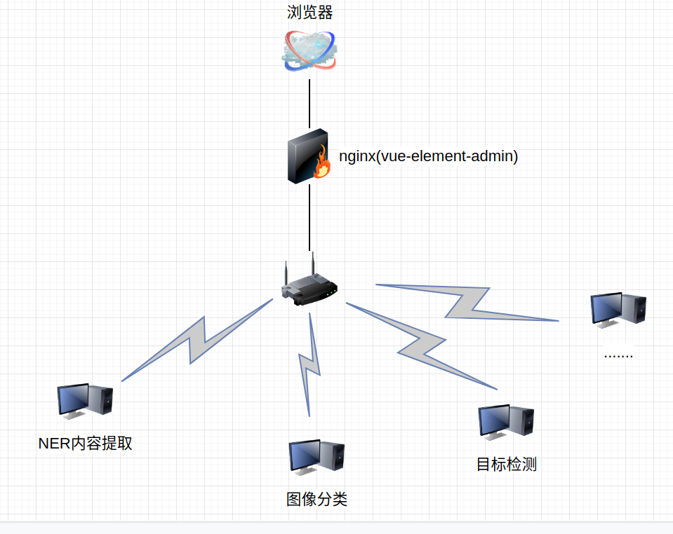
### 总体界面
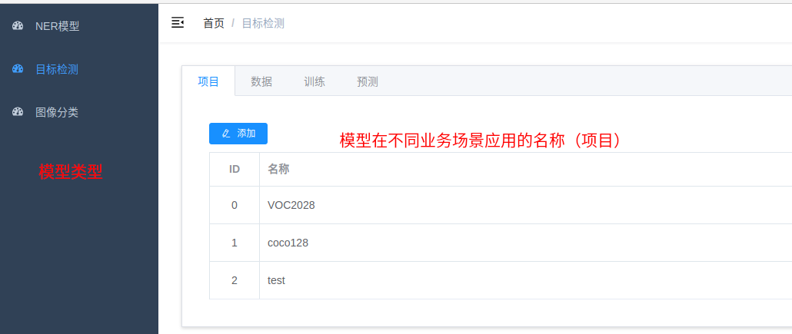
### 基本流程
1. 创建项目
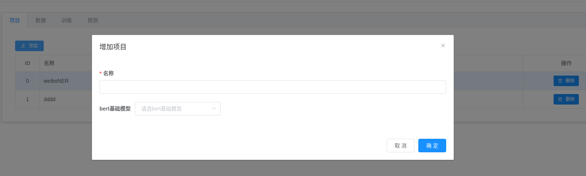
2. 添加对应项目的数据集
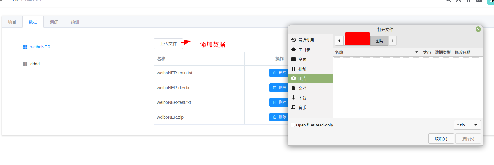
3. 训练
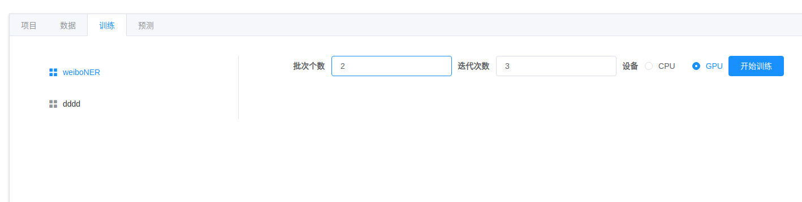
4. 预测，可以调用对应的rest api
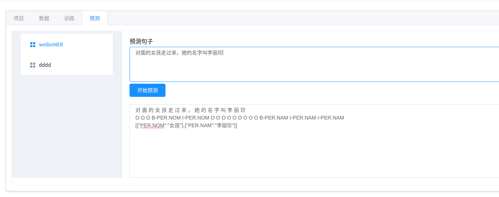
## BERT实现的NER句子内容提取
### 数据格式
##### 使用 BOI 格式
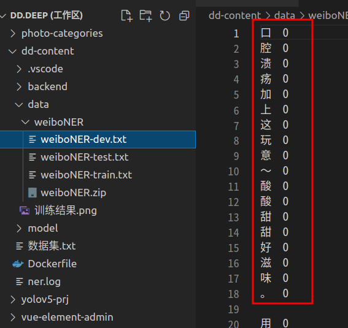
##### 数据目录
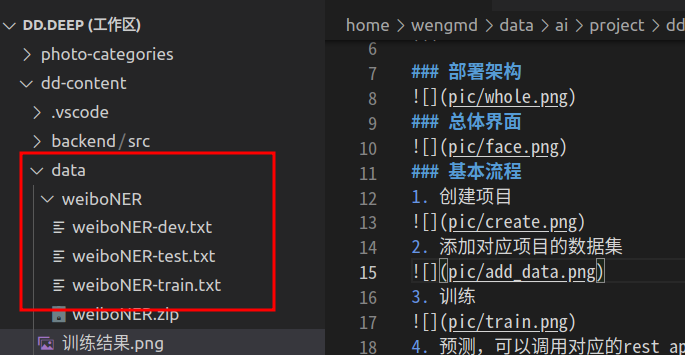
##### 预测

## 图像分类
##### 数据目录
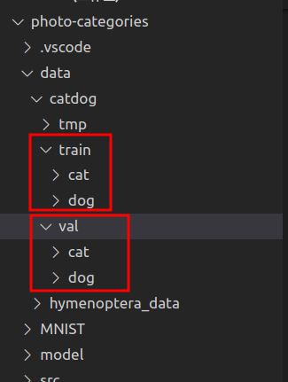
##### 预测
预测的案例图片
```
http://124.222.36.194/images/dog.jpg
http://124.222.36.194/images/cat.jpg
```
## yolov5目标检测
##### 数据目录
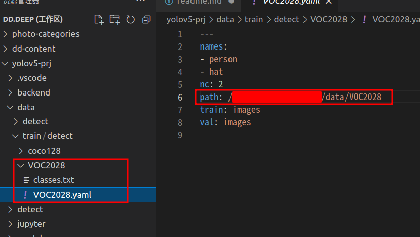
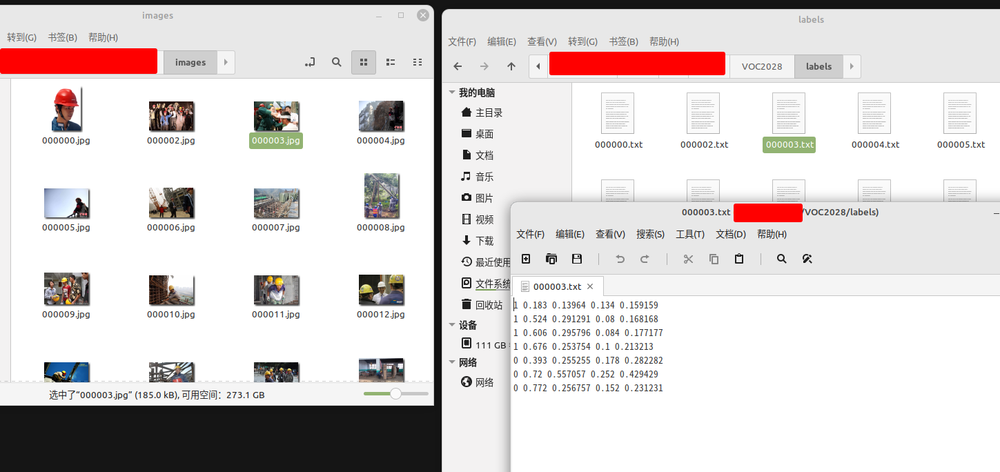
##### 预测
预测的案例图片
```
http://124.222.36.194/images/hat_person.jpg
```
##### 预测结果
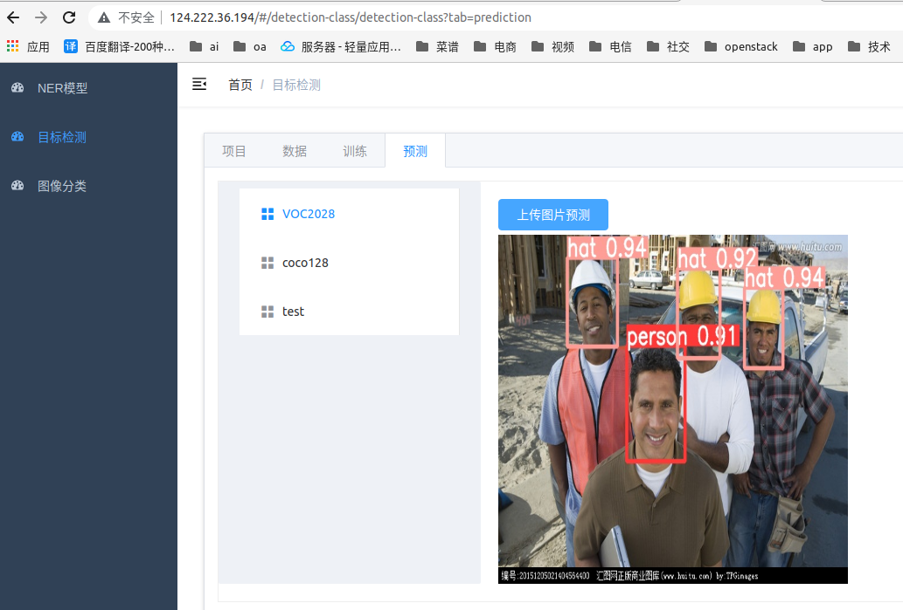
## VUE-ELEMENT-ADMIN前端
##### 来自VUE-ELEMENT-ADMIN，模板修改
##### 使用nginx做前端服务器和后台服务代理
nginx.conf配置
```
server {
        listen       80;
	listen  [::]:80;
        server_name  localhost;

        #charset koi8-r;

        #access_log  logs/host.access.log  main;

		location / {
            root   /app/www;
            autoindex on;  
        }
        
        location /images/ {
            alias /app/images/;
	    	autoindex on;
        }
	
		location /ner/ {
			add_header Cache-Control no-cache;
			add_header Cache-Control private;
			expires -1s;
			proxy_pass http://localhost:28582/;
		}

		location /detection/ {
			add_header Cache-Control no-cache;
			add_header Cache-Control private;
			expires -1s;
			proxy_pass http://localhost:28382/;
		}

		location /img/ {
			add_header Cache-Control no-cache;
			add_header Cache-Control private;
			expires -1s;
			proxy_pass http://localhost:28482/;
		}
```
## docker容器
### 构建镜像
```
docker build -t dddeep:v1 .
```
```
Removing intermediate container 866de083c375
 ---> f0803340cb54
Step 38/46 : COPY ./photo-categories ./photo-categories
 ---> 0d917f6795d5
Step 39/46 : COPY ./dd-content ./dd-content
 ---> 88f8565cb740
Step 40/46 : COPY ./yolov5-prj ./yolov5-prj
 ---> 9f441e497fe6
Step 41/46 : COPY ./dd-deep-front/vue-element-admin/dist ./www
 ---> 0ee9dbcc63f5
Step 42/46 : ADD ./nginx.conf /usr/local/nginx/conf/
 ---> 875a0d8fe504
Step 43/46 : COPY start.sh .
 ---> 1cad813647db
Step 44/46 : RUN chmod +x start.sh
 ---> Running in 355ad926fd74
Removing intermediate container 355ad926fd74
 ---> 488b58ac5c68
Step 45/46 : ENTRYPOINT ["/app/start.sh"]
 ---> Running in 935b571763b5
Removing intermediate container 935b571763b5
 ---> c27a972960a0
Step 46/46 : EXPOSE 80
 ---> Running in 609c2736b3d5
Removing intermediate container 609c2736b3d5
 ---> 588251e4a32f
Successfully built 588251e4a32f
Successfully tagged dddeep:v1
```
### 创建容器
```
docker run --name dddeep_1 -d --gpus all -p 80:80 dddeep:v1
```

### 进入容器
1. docker exec -it dddeep_1 /bin/bash
2. 查看启动的python服务，缺少yolov5的服务
```
root@f74abc4faa27:/app# ps -ef|grep python3
root           8       1 21 12:10 ?        00:00:06 /usr/bin/python3 /usr/local/bin/uvicorn main:app --host 0.0.0.0 --port 28582
root          10       1 14 12:10 ?        00:00:04 /usr/bin/python3 /usr/local/bin/uvicorn main:app --host 0.0.0.0 --port 28482
```
3. 尝试启动yolov5服务
```
cd /app/yolov5-prj
source /app/yolov5-prj-venv/bin/activate
export PYTHONIOENCODING=utf-8
export PYTHONPATH=/app/yolov5-prj/backend/src:/app/yolov5-prj/yolov5
uvicorn main:app --host 0.0.0.0 --port 28382
```
出现缺少库错误
```
root@f74abc4faa27:/app# cd /app/yolov5-prj
root@f74abc4faa27:/app/yolov5-prj# source /app/yolov5-prj-venv/bin/activate
(yolov5-prj-venv) root@f74abc4faa27:/app/yolov5-prj# export PYTHONIOENCODING=utf-8
(yolov5-prj-venv) root@f74abc4faa27:/app/yolov5-prj# export PYTHONPATH=/app/yolov5-prj/backend/src:/app/yolov5-prj/yolov5
(yolov5-prj-venv) root@f74abc4faa27:/app/yolov5-prj# uvicorn main:app --host 0.0.0.0 --port 28382
Traceback (most recent call last):
  File "/usr/local/bin/uvicorn", line 8, in <module>
    sys.exit(main())
  File "/usr/local/lib/python3.8/dist-packages/click/core.py", line 1128, in __call__
    return self.main(*args, **kwargs)
  File "/usr/local/lib/python3.8/dist-packages/click/core.py", line 1053, in main
    rv = self.invoke(ctx)
  File "/usr/local/lib/python3.8/dist-packages/click/core.py", line 1395, in invoke
    return ctx.invoke(self.callback, **ctx.params)
  File "/usr/local/lib/python3.8/dist-packages/click/core.py", line 754, in invoke
    return __callback(*args, **kwargs)
  File "/usr/local/lib/python3.8/dist-packages/uvicorn/main.py", line 425, in main
    run(app, **kwargs)
  File "/usr/local/lib/python3.8/dist-packages/uvicorn/main.py", line 447, in run
    server.run()
  File "/usr/local/lib/python3.8/dist-packages/uvicorn/server.py", line 68, in run
    return asyncio.run(self.serve(sockets=sockets))
  File "/usr/lib/python3.8/asyncio/runners.py", line 44, in run
    return loop.run_until_complete(main)
  File "/usr/lib/python3.8/asyncio/base_events.py", line 616, in run_until_complete
    return future.result()
  File "/usr/local/lib/python3.8/dist-packages/uvicorn/server.py", line 76, in serve
    config.load()
  File "/usr/local/lib/python3.8/dist-packages/uvicorn/config.py", line 448, in load
    self.loaded_app = import_from_string(self.app)
  File "/usr/local/lib/python3.8/dist-packages/uvicorn/importer.py", line 24, in import_from_string
    raise exc from None
  File "/usr/local/lib/python3.8/dist-packages/uvicorn/importer.py", line 21, in import_from_string
    module = importlib.import_module(module_str)
  File "/usr/lib/python3.8/importlib/__init__.py", line 127, in import_module
    return _bootstrap._gcd_import(name[level:], package, level)
  File "<frozen importlib._bootstrap>", line 1014, in _gcd_import
  File "<frozen importlib._bootstrap>", line 991, in _find_and_load
  File "<frozen importlib._bootstrap>", line 975, in _find_and_load_unlocked
  File "<frozen importlib._bootstrap>", line 671, in _load_unlocked
  File "<frozen importlib._bootstrap_external>", line 848, in exec_module
  File "<frozen importlib._bootstrap>", line 219, in _call_with_frames_removed
  File "/app/yolov5-prj/backend/src/main.py", line 2, in <module>
    from api import api_yolov5
  File "/app/yolov5-prj/backend/src/api/api_yolov5.py", line 16, in <module>
    import detect
  File "/app/yolov5-prj/yolov5/detect.py", line 14, in <module>
    import cv2
  File "/usr/local/lib/python3.8/dist-packages/cv2/__init__.py", line 180, in <module>
    bootstrap()
  File "/usr/local/lib/python3.8/dist-packages/cv2/__init__.py", line 152, in bootstrap
    native_module = importlib.import_module("cv2")
  File "/usr/lib/python3.8/importlib/__init__.py", line 127, in import_module
    return _bootstrap._gcd_import(name[level:], package, level)
ImportError: libgthread-2.0.so.0: cannot open shared object file: No such file or directory
```
4. 安装库libglib2.0-dev
```
(yolov5-prj-venv) root@f74abc4faa27:/app/yolov5-prj# apt-get install libglib2.0-dev -y
```
安装过程需要选择时区，选择“亚洲”> “上海”
```
Please select the geographic area in which you live. Subsequent configuration questions will narrow this down by presenting a list of cities, representing the time zones in which
they are located.

  1. Africa  2. America  3. Antarctica  4. Australia  5. Arctic  6. Asia  7. Atlantic  8. Europe  9. Indian  10. Pacific  11. SystemV  12. US  13. Etc
Geographic area: 6

Please select the city or region corresponding to your time zone.

  1. Aden      10. Bahrain     19. Chongqing  28. Harbin       37. Jerusalem    46. Kuala_Lumpur  55. Novokuznetsk  64. Qyzylorda      73. Taipei         82. Ulaanbaatar
  2. Almaty    11. Baku        20. Colombo    29. Hebron       38. Kabul        47. Kuching       56. Novosibirsk   65. Rangoon        74. Tashkent       83. Urumqi
  3. Amman     12. Bangkok     21. Damascus   30. Ho_Chi_Minh  39. Kamchatka    48. Kuwait        57. Omsk          66. Riyadh         75. Tbilisi        84. Ust-Nera
  4. Anadyr    13. Barnaul     22. Dhaka      31. Hong_Kong    40. Karachi      49. Macau         58. Oral          67. Sakhalin       76. Tehran         85. Vientiane
  5. Aqtau     14. Beirut      23. Dili       32. Hovd         41. Kashgar      50. Magadan       59. Phnom_Penh    68. Samarkand      77. Tel_Aviv       86. Vladivostok
  6. Aqtobe    15. Bishkek     24. Dubai      33. Irkutsk      42. Kathmandu    51. Makassar      60. Pontianak     69. Seoul          78. Thimphu        87. Yakutsk
  7. Ashgabat  16. Brunei      25. Dushanbe   34. Istanbul     43. Khandyga     52. Manila        61. Pyongyang     70. Shanghai       79. Tokyo          88. Yangon
  8. Atyrau    17. Chita       26. Famagusta  35. Jakarta      44. Kolkata      53. Muscat        62. Qatar         71. Singapore      80. Tomsk          89. Yekaterinburg
  9. Baghdad   18. Choibalsan  27. Gaza       36. Jayapura     45. Krasnoyarsk  54. Nicosia       63. Qostanay      72. Srednekolymsk  81. Ujung_Pandang  90. Yerevan
Time zone: 70
```
5. 安装成功后，再执行启动yolov5服务
```
uvicorn main:app --host 0.0.0.0 --port 28382
```
```
(yolov5-prj-venv) root@f74abc4faa27:/app/yolov5-prj# uvicorn main:app --host 0.0.0.0 --port 28382
INFO:     Started server process [332]
INFO:     Waiting for application startup.
INFO:     Application startup complete.
INFO:     Uvicorn running on http://0.0.0.0:28382 (Press CTRL+C to quit)
^CINFO:     Shutting down
INFO:     Waiting for application shutdown.
INFO:     Application shutdown complete.
INFO:     Finished server process [332]
```
6. 退出容器，停止容器，重新启动容器
```
(yolov5-prj-venv) root@f74abc4faa27:/app/yolov5-prj# exit

docker ps
CONTAINER ID   IMAGE       COMMAND           CREATED          STATUS          PORTS                               NAMES
f74abc4faa27   dddeep:v1   "/app/start.sh"   16 minutes ago   Up 16 minutes   0.0.0.0:80->80/tcp, :::80->80/tcp   dddeep_1

docker stop dddeep_1 

docker start dddeep_1
```